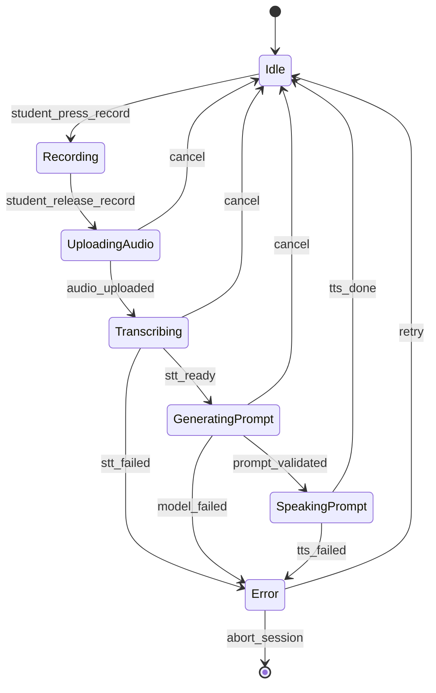

# Dialogos v0.1 — Implementation-Ready Spec

**Status:** Draft v0.2 (scope updated to include differentiation features; phased delivery)
**Primary platform:** Mobile (Flutter)
**Backend:** TypeScript (Fastify) + Prisma + Postgres (Supabase) + Object Storage (Supabase Storage or S3)
**Core interaction style:** Socrates Mode always-on (AI personality); Trivium Stage selectable per session

---

## 0) Product definition

**Dialogos is a voice-first practice system that trains oral mastery through structured Socratic coaching, source-grounded sessions, and long-term knowledge tracking — without ever doing the thinking for the student.**

It is not a chat wrapper. It is a practice system with memory, progression, and metrics.

### 0.1 Non-negotiables

- **Socrates Mode is the AI personality** — always on. Witty, direct, polite, insightful, no sycophancy. Separate from Trivium Stage selection.
- **Trivium Stage is selectable** per session: Grammar, Logic, Rhetoric, or Combined (default).
- **One move per turn:** exactly one question or instruction per assistant turn.
- **No praise / no padding / no recap unless asked.**
- **Audio-first UX:** minimal screen attention; screen exists for control + review.
- **Source-grounded:** sessions attach to a Source; AI anchors student claims against source material when available.
- **Anti-offloading:** AI never synthesizes, summarizes sources, or writes the student's argument.
- **Student terminology:** call them *student*, not *user*.

### 0.2 Success criteria

- A student can complete a session hands-free/eyes-free except for starting/stopping.
- Output is consistently non-sycophantic and low-fluff.
- Artifacts (transcript, summary, rubric) feel like a coach's notes, not an essay generator.
- Cost per session is predictable and capped.

---

## 1) Scope (phased delivery)

### 1.1 Phase 1: Core Session Loop

- Authentication: Apple + Google
- CRUD for Topics, Sessions
- Source entity (photo/OCR, document upload, reference, voice summary)
- File uploads attached to Topics via TopicFile
- Source-to-session linking
- Trivium stage selection per session
- Voice session loop: record → transcribe → generate next prompt → speak prompt
- Deterministic Socratic rules + source-anchoring enforcement
- Transcript in screenplay format
- End-of-session summary with Grammar/Logic/Rhetoric sections
- Rubric scoring
- Per-session metrics storage

### 1.2 Phase 2: Concept Ledger

- Candidate extraction from session transcripts (student's verbatim speech only)
- Approve/reject/tag/link workflow (voice or minimal taps)
- LedgerEntry CRUD
- Ledger view per topic
- Link entries to sources and topics

### 1.3 Phase 3: Spaced Re-oralization

- ReviewScheduleItem entity + scheduling logic (3/7/21 day defaults)
- Mini re-oralization sessions (60–90 seconds)
- Resurface past definitions/theses from Concept Ledger
- In-app notification/prompt system

### 1.4 Phase 4: Analytics + Argument Fingerprint

- Cross-session trend queries
- Form-based signal tracking over time
- Personal pattern detection
- Trends dashboard

### 1.5 Phase 5: Billing + Launch Polish

- Trial cap enforcement + paywall + subscription
- OCR extraction (for photo sources)
- Reference lookup (for known texts)
- Delete/export all personal data

### 1.6 Explicitly out of scope

- Teacher/classroom reporting
- Deep pronunciation scoring
- Somatonoetics/embodiment module
- Multi-agent analysis
- "Friendly tutor" mode
- Social/community features

---

## 2) Core domain objects

### 2.1 Student

Represents an authenticated person.

- `id` (UUID)
- `email` (nullable if provider doesn't provide; store normalized)
- `displayName`
- `createdAt`, `updatedAt`
- `settings` (JSON: voice rate, autoplay, strictness flags)
- `plan` (free | paid)
- `trialRemainingSeconds` (int)
- `deletedAt` (nullable)

### 2.2 Topic

Long-lived study project.

- `id` (UUID)
- `studentId` (FK)
- `title`
- `description` (optional)
- `createdAt`, `updatedAt`, `deletedAt`

### 2.3 TopicFile

Uploaded file reference (PDF/image/text). Raw storage layer — no semantic content.

- `id` (UUID)
- `topicId` (FK)
- `kind` (pdf | image | text | other)
- `storageKey`
- `originalName`
- `mimeType`
- `sizeBytes`
- `createdAt`, `deletedAt`

### 2.4 Source

Semantic content entity representing what the student is studying. May or may not be backed by a TopicFile. A session links to a Source for context grounding.

- `id` (UUID)
- `topicId` (FK)
- `topicFileId` (FK, nullable — null for reference/voice-summary types)
- `sourceType` (photo_ocr | document | reference | voice_summary)
- `title` (student's label for this source)
- `citation` (nullable — e.g. "Republic 327a–331d")
- `extractedText` (nullable — populated by OCR, doc extraction, or STT)
- `groundingTier` (1 | 2 | 3 — derived from sourceType + text availability)
- `createdAt`, `deletedAt`

### 2.5 Session

Discrete practice run inside a topic, linked to a source.

- `id` (UUID)
- `topicId` (FK)
- `studentId` (FK redundant but convenient for queries)
- `sourceId` (FK, nullable — sessions should have a source but may not always)
- `triviumStage` (grammar | logic | rhetoric | combined)
- `status` (draft | active | ended | aborted)
- `startedAt`, `endedAt`
- `costCentsEstimate` (int)
- `trialSecondsUsed` (int)
- `deletedAt`

### 2.6 Turn

A single exchange: student utterance → system prompt.

- `id` (UUID)
- `sessionId` (FK)
- `index` (int, 0..n)
- `studentAudioKey` (nullable)
- `studentText` (nullable until STT completes)
- `assistantText` (the spoken prompt; short)
- `assistantPromptType` (enum)
- `assistantDetectedIssue` (enum/string)
- `createdAt`, `latencyMs`

### 2.7 Artifacts

Generated at end of session (and optionally mid-session).

- `SessionArtifact`
  - `id` (UUID)
  - `sessionId` (FK)
  - `kind` (transcript | summary | rubric | export_md)
  - `content` (TEXT or JSON)
  - `createdAt`

### 2.8 LedgerEntry (Phase 2)

A knowledge entry built from the student's own verbatim speech. Never AI-authored.

- `id` (UUID)
- `studentId` (FK)
- `topicId` (FK)
- `sourceId` (FK, nullable)
- `sessionId` (FK — which session produced this entry)
- `entryType` (thesis | definition | distinction | objection_response)
- `verbatimText` (TEXT — exact quote from student speech)
- `tags` (TEXT[] or JSON array)
- `linkedEntryIds` (UUID[] — links to related ledger entries)
- `status` (candidate | approved | discarded)
- `createdAt`, `updatedAt`, `deletedAt`

### 2.9 ReviewScheduleItem (Phase 3)

Spaced re-oralization schedule entry.

- `id` (UUID)
- `studentId` (FK)
- `sessionId` (FK, nullable — the originating session)
- `ledgerEntryId` (FK, nullable — the specific entry to resurface)
- `promptType` (re_explain | restate_definition | challenge_thesis | strongest_objection)
- `promptText` (TEXT — the specific prompt to present, e.g. "Re-explain justice in 90 seconds")
- `dueAt` (TIMESTAMPTZ)
- `completedAt` (TIMESTAMPTZ, nullable)
- `status` (pending | completed | skipped | expired)
- `createdAt`

---

## 3) UX / flows (mobile)

### 3.1 Onboarding

1. Sign in (Apple/Google)
2. Audio-led onboarding rules (pre-recorded audio to avoid model cost):
   - "You will be questioned. I won't supply the missing substance."
   - "One prompt at a time. Keep answers short."
3. Create first Topic (title + optional description)
4. Start first Session (trial)

### 3.2 Navigation

- **Topics list**
  - Create Topic
  - Delete Topic (soft-delete; cascades to sessions/files)
- **Topic detail**
  - Sessions list (latest first)
  - Files list
  - Start new session
- **Session detail (review)**
  - Summary
  - Rubric
  - Transcript (screenplay)
  - Export

### 3.3 Session screen (audio-first)

- Dark background, minimal UI
- Primary control: **push-to-talk** (PTT) or tap-to-record
- Secondary: end session, pause, repeat prompt, show transcript
- Optional: keep screen awake toggle
- No distracting waveform; allow subtle "listening" indicator

---

## 4) Socrates Mode: behavioral contract (AI personality — always on)

**Important:** Socrates Mode is the AI's personality and enforcement contract, not a session type. It is always active regardless of which Trivium Stage the student selects. Trivium Stage (Grammar/Logic/Rhetoric/Combined) determines the pedagogical focus; Socrates Mode determines how the AI behaves.

These are not aspirational instructions to the model. They are **mechanical guarantees** enforced by server-side validation. The model is one component; the enforcement layer is what turns tone guidance into a reliable contract.

Design goal: **"rules + LLM"** — the LLM provides conversational flexibility, but the rules provide deterministic enforcement that a generic chat UI cannot.

### 4.1 Output schema (strict)

All model outputs used for prompting MUST validate against this JSON schema:

```json
{
  "next_prompt": "string (<= 12 words default)",
  "prompt_type": "define | distinguish | premise | inference | objection | compress | clarify | example | scope | contradiction | locate_passage | reconcile | redirect_to_student | scaffold",
  "detected_issue": "vague_term | missing_premise | equivocation | drift | contradiction | unclear_referent | unsupported_claim | unsupported_by_source | contradicts_source | misattribution | content_request | none",
  "stop_reason": "needs_definition | needs_example | needs_premise | needs_scope | needs_source_evidence | ok_continue"
}
```

Only `next_prompt` is spoken to the student. All other fields are stored for instrumentation and artifact generation but never surfaced during the session.

New prompt types for source-anchoring: `locate_passage` (demand textual evidence), `reconcile` (flag contradiction with source).

New prompt types for content question handling: `redirect_to_student` (Socratic turn-back when student asks for content), `scaffold` (partial scaffold when student is stuck — quote a passage, narrow the question, highlight a structural clue).

New detected issues for source-anchoring: `unsupported_by_source`, `contradicts_source`, `misattribution`.

New detected issue for content question handling: `content_request` (student asked for summary, explanation, or meaning of source material).

### 4.2 Style constraints

Hard rules (enforced by server-side validation + regeneration):

- `next_prompt` must be **one sentence**.
- No praise words (blocklist): "great", "perfect", "awesome", "nice job", "excellent", "love", "good" (in evaluative sense), etc.
- No recap unless the student explicitly requests a recap (detect via intent or explicit phrase).
- No unsolicited teaching paragraphs.
- Default `next_prompt` word count ≤ 12 (configurable to 16 max; keep it tight).
- Concise but conversational — not "1960s robot dry."
- Prefer one sharp follow-up question over long checklists.

### 4.3 Deterministic Socratic rules

These are mechanical guardrails enforced as rules, not suggestions to the model:

| Trigger | Required response |
|---|---|
| Student uses key term without definition | Interrupt: "Define [term]." |
| Student makes a claim without example | Demand example before proceeding. |
| Student answers objection by changing thesis (drift) | Call out drift. Require restatement of original thesis. |
| Student equivocates on a term | Ask for explicit distinction. |
| Student never states a conclusion | Require one before proceeding. |

### 4.4 Source-anchoring rules

When the session's Source has extracted text (Tier 1) or is a known canonical work (Tier 2), the AI applies additional content-anchoring rules. These are still Socratic — the AI asks questions, never provides the "correct" reading.

| Trigger | Required response |
|---|---|
| Student claims "the author argues X" but source doesn't support it | "Where does the author say that? Quote or paraphrase the passage." |
| Student's paraphrase directly contradicts source text | "[Source quote]. You said [their claim]. Reconcile." |
| Student presents conclusion as the source's without evidence | "Is that the author's claim or yours? Distinguish." |
| Student builds argument on a passage they haven't located | "Which passage are you drawing from? Locate it." |

**Anti-offloading constraint:** The AI never says "here's what the text actually means." It holds the student accountable to the text without explaining it for them.

**Source-grounding tiers:**

| Tier | Source availability | AI capability |
|---|---|---|
| **Tier 1** | Extracted text available (OCR, doc upload) | Strongest grounding. Can quote source verbatim. |
| **Tier 2** | Known/canonical text, no upload | Draws on training knowledge. Can demand evidence, flag likely misreadings. |
| **Tier 3** | Obscure or no source text | Form-only coaching. Cannot verify content claims. |

### 4.5 Content question handling (redirect → scaffold)

When a student asks a direct question about the source material ("What does the author mean by X?" or "Can you summarize this passage?"), the AI does not simply refuse or comply. It follows a two-tier redirect-then-scaffold protocol.

**Phase 1 behavior (current):**

| Tier | Trigger | AI response |
|---|---|---|
| **Redirect** (first ask) | Student asks for summary, explanation, or meaning of source content | Socratic redirect. "What do *you* think the author means? Paraphrase it." / "State it in your own words first." |
| **Scaffold** (repeated ask or "I don't know") | Student asks again, or explicitly says they're stuck | Partial scaffold — never the answer. Narrow the question, quote a relevant passage, or highlight a structural clue. E.g., "The author uses 'justice' three times in this paragraph. What do you notice about how the usage shifts?" |

The AI never provides the full answer at either tier. The scaffold gives the student something to push against, not something to copy.

**Design rationale:** A real Socrates offered content — but always through questions. Rigidly refusing a stuck student is paternalistic; immediately answering undermines the product. The redirect-then-scaffold pattern matches how effective human tutors actually behave.

**Future evolution (Phase 2+):** Add a third tier — if the student explicitly asks a third time, comply but quarantine. The AI provides a reading of the passage, then immediately demands the student's own articulation ("Here's one reading. Now — do you agree? State your own position."). Any AI-provided content is:
- Flagged in the session transcript as `ai_provided_content`
- Excluded from Concept Ledger candidate extraction
- Tracked in session metrics (`content_requests_count` vs `student_generated_count`)

This preserves the anti-offloading principle while respecting student autonomy and providing an honest record of what happened.

### 4.6 Enforcement loop

Every model response goes through a validation pipeline before reaching the student:

1. **Schema validation** — response must parse against the strict JSON schema. If not, regenerate (up to 2 retries, then fail the turn gracefully).
2. **Word cap check** — count words in `next_prompt`. If over limit, regenerate.
3. **Banned-phrase scan** — run `next_prompt` against the praise/padding blocklist. If match, regenerate.
4. **Sentence count check** — `next_prompt` must contain exactly one sentence. If not, regenerate.
5. **TTS gate** — only the `next_prompt` field is sent to TTS / spoken aloud. No other field is ever surfaced to the student during the session.

This pipeline is the difference between "we asked the model to behave" and "the system guarantees it." A general chat UI cannot enforce this; the enforcement layer is a core product requirement.

### 4.7 Prompting strategy

- Run model in **structured output mode**.
- Keep conversation context minimal:
  - include last N turns (N=6 by default)
  - include session goal (topic title + optional description)
  - include source extracted text (or citation for Tier 2) when available
  - include current trivium stage (grammar/logic/rhetoric/combined)
- Use a "Socrates system message" that describes:
  - allowed moves + bans
  - deterministic rules (Section 4.3)
  - source-anchoring rules (Section 4.4) with grounding tier
- Low temperature, small token cap.

---

## 5) Session state machine

### 5.1 State definitions

- `DRAFT`: created but not started
- `ACTIVE`: in progress
- `ENDED`: completed successfully
- `ABORTED`: ended early (network / user / payment)

### 5.2 Turn-level state machine

Each "turn" is an internal mini-state machine; the session is a repetition of turns.



### 5.3 Session lifecycle

- Create session → `DRAFT`
- Start session → `ACTIVE`
- End session (student ends or trial ends) → `ENDED` or `ABORTED`
- Generate artifacts as async job upon `ENDED`

---

## 6) Backend architecture (TypeScript)

### 6.1 Layers

1) **API Layer**
- Fastify routes
- auth, input/output validation
- calls Services only

2) **Service Layer**
- business logic orchestration
- session state transitions
- cost accounting
- queue job scheduling

3) **DataSource Layer**
- one class per table
- Prisma-only operations
- no business logic

### 6.2 Folder structure (suggested)

```
/src
  /api
    /v1
      topics.routes.ts
      sources.routes.ts          # Phase 1
      sessions.routes.ts
      files.routes.ts
      ledger.routes.ts           # Phase 2
      reviews.routes.ts          # Phase 3
      analytics.routes.ts        # Phase 4
      billing.routes.ts          # Phase 5
      account.routes.ts          # Phase 5
    auth.plugin.ts
    validation.ts
  /services
    TopicService.ts
    TopicFileService.ts
    SourceService.ts             # Phase 1
    SessionService.ts
    TurnService.ts
    ArtifactService.ts
    LedgerService.ts             # Phase 2
    ReviewScheduleService.ts     # Phase 3
    AnalyticsService.ts          # Phase 4
    BillingService.ts            # Phase 5
  /dataSources
    StudentDataSource.ts
    TopicDataSource.ts
    TopicFileDataSource.ts
    SourceDataSource.ts          # Phase 1
    SessionDataSource.ts
    TurnDataSource.ts
    SessionArtifactDataSource.ts
    SessionMetricsDataSource.ts
    LedgerEntryDataSource.ts     # Phase 2
    ReviewScheduleDataSource.ts  # Phase 3
  /types
    api.ts
    dto.ts
    db.ts
    domain.ts
  /jobs
    queue.ts
    jobs.ts
    handlers/
      transcribeTurn.ts
      generatePrompt.ts
      renderArtifacts.ts
      extractLedgerCandidates.ts  # Phase 2
      scheduleReviews.ts          # Phase 3
  /lib
    logger.ts
    errors.ts
    time.ts
```

### 6.3 Validation

- Use Zod (or equivalent) for request/response validation.
- For AI prompt outputs, validate strictly and regenerate if invalid.

### 6.4 Security hardening

The following security measures are required at the backend layer. These were identified in the security audit (see `docs/SECURITY_AUDIT.md`).

#### 6.4.1 Input validation constraints

All string inputs must have length constraints enforced via Zod:

| Field | Max length | Notes |
|-------|-----------|-------|
| `title` (topics, sources) | 500 | `.min(1).max(500)` |
| `description` (topics) | 5,000 | `.max(5000)` |
| `citation` (sources) | 1,000 | `.max(1000)` |
| `extractedText` (sources) | 500,000 | `.max(500_000)` |
| `originalName` (files) | 500 | `.min(1).max(500)` |
| `mimeType` (files) | 255 | `.max(255)` |
| `displayName` (students) | 500 | `.min(1).max(500)` |

File uploads:
- `kind` field: enum-validated (`pdf | image | text | other`)
- `sizeBytes`: max 50 MB (`52_428_800`)
- `storageKey`: validated against regex `^topics/[a-f0-9-]{36}/files/[a-f0-9-]{36}/.+$`

Student settings are stored as typed scalar columns (`voice_rate`, `autoplay`, `strictness`) — not JSONB. This gives full database-level type safety, indexability, and eliminates the need for runtime JSON parsing.

Billing-sensitive fields (`plan`, `trialRemainingSeconds`) must never be accepted from client input. These are server-only.

#### 6.4.2 HTTP security

- **CORS**: Explicit origin allowlist via `CORS_ORIGIN` env var (comma-separated). Falls back to permissive only in dev/test; production rejects unrecognized origins.
- **Security headers**: `@fastify/helmet` with HSTS enabled (`max-age: 31536000`).
- **Rate limiting**: `@fastify/rate-limit` — 100 requests/minute default. Tighter limits on mutation and auth endpoints.
- **Body limit**: Explicit 1 MB default via Fastify `bodyLimit`. Routes needing larger payloads (e.g., source creation with `extractedText`) override per-route.
- **Swagger UI**: Restricted to non-production (`NODE_ENV !== "production"`).

#### 6.4.3 Authentication hardening

- JWT verification with explicit algorithm restriction (`HS256`).
- In-memory known-student cache bounded to 10,000 entries (evicts oldest on overflow).
- Filename sanitization: strip `..`, `/`, `\`, null bytes, control characters, and limit to 255 chars.
- Presigned upload URLs include `ContentLength` condition to prevent oversized uploads.
- Error messages must not leak internal state (e.g., session status). Log details server-side; return generic messages to client.
- Graceful shutdown on `SIGTERM`/`SIGINT` to close connections cleanly.

#### 6.4.4 LLM prompt injection mitigations (Phase 1 turn pipeline)

Student speech enters the model context via STT transcription. To mitigate prompt injection:

1. **Delimiter isolation**: Wrap student text in clearly delineated delimiters (e.g., `<student_speech>...</student_speech>`) that the system prompt instructs the model to treat as user content only.
2. **Input sanitization**: Strip control characters and enforce length limits on transcribed text before prompt inclusion.
3. **Source text sanitization**: Strip non-printable characters and control sequences from `extractedText` before including in the model context. Clearly delineate source text with role-based markers.
4. **Structured output validation**: The enforcement loop (Section 4.6) validates all model output against the strict JSON schema — this limits what a prompt injection could achieve even if the model is manipulated.
5. **Output field validation**: Validate `assistantPromptType` and `assistantDetectedIssue` against their expected enums at the persistence layer, not just schema-level.
6. **Monitoring**: Track retry rates per session and flag anomalous model output distributions.

#### 6.4.5 Audio upload validation (Phase 1 turn pipeline)

- Validate MIME type on presigned audio URLs (`audio/webm`, `audio/wav`, etc.).
- After upload, verify the file is actually audio before processing (lightweight probe).
- Maximum audio file size: 10 MB per turn.

#### 6.4.6 Turn index concurrency (Phase 1 PR-2)

Use an atomic `INSERT ... SELECT MAX(index) + 1` query or a database sequence for turn index assignment. Handle unique constraint violations (`@@unique([sessionId, index])`) with a bounded retry.

#### 6.4.7 Webhook security (Phase 5)

- All billing webhook endpoints must verify HMAC signatures from the payment provider.
- Webhook processing must be idempotent — track processed webhook IDs and skip duplicates.

#### 6.4.8 Privacy & data deletion

- Hard-delete job must be implemented before launch. Define retention window (e.g., 30 days after soft-delete).
- Cascade soft-delete: deleting a topic must cascade to sessions, files, and sources.
- Concept Ledger `verbatimText` is sensitive personal data — include in export/deletion flows, verify encryption at rest.
- Replace `linkedEntryIds` UUID array with a join table (`ledger_entry_links`) for referential integrity.

#### 6.4.9 Mobile client security (documented for Flutter team)

- Store JWT tokens in platform-specific secure storage (iOS Keychain, Android Keystore).
- Implement certificate pinning for production builds.
- Delete local audio files immediately after successful upload.

#### 6.4.10 CI/CD security

- Workflow-level permissions default to `contents: read`; only the deploy job gets `contents: write`.
- `npm audit --audit-level=high` runs as a CI step.
- Consider enabling Dependabot or equivalent for supply chain monitoring.

---

## 7) Database schema (Postgres)

### 7.1 Tables

Schema (DDL sketch):

```sql
-- Phase 0 (existing)

create type strictness as enum ('low', 'medium', 'high');

create table students (
  id uuid primary key,
  email text,
  display_name text not null,
  plan text not null default 'free',
  trial_remaining_seconds int not null default 180,
  voice_rate double precision,
  autoplay boolean,
  strictness strictness,
  created_at timestamptz not null default now(),
  updated_at timestamptz not null default now(),
  deleted_at timestamptz
);

create table topics (
  id uuid primary key,
  student_id uuid not null references students(id),
  title text not null,
  description text,
  created_at timestamptz not null default now(),
  updated_at timestamptz not null default now(),
  deleted_at timestamptz
);

create table topic_files (
  id uuid primary key,
  topic_id uuid not null references topics(id),
  kind text not null,
  storage_key text not null,
  original_name text not null,
  mime_type text,
  size_bytes bigint not null,
  created_at timestamptz not null default now(),
  deleted_at timestamptz
);

-- Phase 1 (new: sources, updated sessions)

create table sources (
  id uuid primary key,
  topic_id uuid not null references topics(id),
  topic_file_id uuid references topic_files(id),
  source_type text not null, -- photo_ocr | document | reference | voice_summary
  title text not null,
  citation text, -- e.g. "Republic 327a-331d"
  extracted_text text,
  grounding_tier int not null default 3, -- 1 | 2 | 3
  created_at timestamptz not null default now(),
  deleted_at timestamptz
);

create table sessions (
  id uuid primary key,
  student_id uuid not null references students(id),
  topic_id uuid not null references topics(id),
  source_id uuid references sources(id),
  trivium_stage text not null default 'combined', -- grammar | logic | rhetoric | combined
  status text not null,
  started_at timestamptz,
  ended_at timestamptz,
  cost_cents_estimate int not null default 0,
  trial_seconds_used int not null default 0,
  created_at timestamptz not null default now(),
  deleted_at timestamptz
);

create table turns (
  id uuid primary key,
  session_id uuid not null references sessions(id),
  index int not null,
  student_audio_key text,
  student_text text,
  assistant_text text,
  assistant_prompt_type text,
  assistant_detected_issue text,
  latency_ms int,
  created_at timestamptz not null default now()
);

create unique index turns_session_index on turns(session_id, index);

create table session_artifacts (
  id uuid primary key,
  session_id uuid not null references sessions(id),
  kind text not null,
  content text not null,
  created_at timestamptz not null default now()
);

-- Phase 2 (Concept Ledger)

create table ledger_entries (
  id uuid primary key,
  student_id uuid not null references students(id),
  topic_id uuid not null references topics(id),
  source_id uuid references sources(id),
  session_id uuid not null references sessions(id),
  entry_type text not null, -- thesis | definition | distinction | objection_response
  verbatim_text text not null,
  tags text[] not null default '{}',
  linked_entry_ids uuid[] not null default '{}',
  status text not null default 'candidate', -- candidate | approved | discarded
  created_at timestamptz not null default now(),
  updated_at timestamptz not null default now(),
  deleted_at timestamptz
);

-- Phase 3 (Spaced Re-oralization)

create table review_schedule_items (
  id uuid primary key,
  student_id uuid not null references students(id),
  session_id uuid references sessions(id),
  ledger_entry_id uuid references ledger_entries(id),
  prompt_type text not null, -- re_explain | restate_definition | challenge_thesis | strongest_objection
  prompt_text text not null,
  due_at timestamptz not null,
  completed_at timestamptz,
  status text not null default 'pending', -- pending | completed | skipped | expired
  created_at timestamptz not null default now()
);

create index review_schedule_student_due on review_schedule_items(student_id, due_at)
  where status = 'pending';
```

### 7.2 Notes

- Use soft delete (`deleted_at`) for compliance + safety.
- Add RLS (row-level security) if using Supabase auth directly; if backend owns auth, enforce via API.
- Ensure `turns(session_id, index)` unique for deterministic transcript ordering.

---

## 8) API design (REST, versioned)

### 8.1 Auth

Preferred: server verifies identity tokens from Apple/Google, then issues your own JWT session token.

- `Authorization: Bearer <jwt>`
- JWT contains `studentId`

### 8.2 Endpoints

All endpoints under `/v1`.

#### Topics

- `GET /v1/topics`
  - returns: list of topics (non-deleted)
- `POST /v1/topics`
  - body: `{ title, description? }`
- `GET /v1/topics/:topicId`
- `PATCH /v1/topics/:topicId`
  - body: `{ title?, description? }`
- `DELETE /v1/topics/:topicId`
  - soft-delete; cascades sessions/files

#### Topic files

- `GET /v1/topics/:topicId/files`
- `POST /v1/topics/:topicId/files/presign`
  - body: `{ kind, originalName, mimeType, sizeBytes }`
  - returns: `{ uploadUrl, storageKey }`
- `POST /v1/topics/:topicId/files`
  - body: `{ storageKey, kind, originalName, mimeType, sizeBytes }` (finalize metadata)
- `DELETE /v1/topics/:topicId/files/:fileId`

#### Sources (Phase 1)

- `GET /v1/topics/:topicId/sources`
  - returns: list of sources for topic
- `POST /v1/topics/:topicId/sources`
  - body: `{ sourceType, title, citation?, topicFileId?, extractedText? }`
  - server determines `groundingTier` based on type + text availability
- `GET /v1/topics/:topicId/sources/:sourceId`
- `PATCH /v1/topics/:topicId/sources/:sourceId`
  - body: `{ title?, citation?, extractedText? }`
- `DELETE /v1/topics/:topicId/sources/:sourceId`
  - soft-delete

#### Sessions

- `GET /v1/topics/:topicId/sessions`
- `POST /v1/topics/:topicId/sessions`
  - body: `{ sourceId?, triviumStage? }`
  - creates `DRAFT`; defaults to `combined` stage
- `POST /v1/sessions/:sessionId/start`
  - transitions to `ACTIVE`
- `POST /v1/sessions/:sessionId/end`
  - transitions to `ENDED`, enqueues artifact job + ledger candidate extraction (Phase 2)
- `DELETE /v1/sessions/:sessionId`
  - soft delete

#### Turns (core loop)

- `POST /v1/sessions/:sessionId/turns/presign-audio`
  - returns uploadUrl + storageKey
- `POST /v1/sessions/:sessionId/turns`
  - body: `{ studentAudioKey, durationMs }`
  - server enqueues STT + prompt job
  - returns: `{ turnId }`
- `GET /v1/sessions/:sessionId/turns/:turnId`
  - returns turn including `assistantText` when ready
- Optional realtime:
  - `GET /v1/sessions/:sessionId/stream` (SSE or WebSocket) to push `assistantText` updates

#### Artifacts

- `GET /v1/sessions/:sessionId/artifacts`
- `GET /v1/sessions/:sessionId/artifacts/:artifactId`

#### Concept Ledger (Phase 2)

- `GET /v1/topics/:topicId/ledger`
  - returns: list of approved ledger entries for topic
- `GET /v1/sessions/:sessionId/ledger-candidates`
  - returns: candidate entries extracted from session (status=candidate)
- `PATCH /v1/ledger/:entryId`
  - body: `{ status?, tags?, linkedEntryIds? }`
  - approve/discard/tag/link entries
- `DELETE /v1/ledger/:entryId`
  - soft-delete

#### Review Schedule (Phase 3)

- `GET /v1/reviews/upcoming`
  - returns: pending review items for authenticated student, ordered by due date
- `POST /v1/reviews/:reviewId/complete`
  - body: `{ }` — marks as completed
- `POST /v1/reviews/:reviewId/skip`
  - body: `{ }` — marks as skipped

#### Billing / trial (Phase 5)

- `GET /v1/billing/status`
- `POST /v1/billing/checkout` (store-specific; may be handled client-side)
- `POST /v1/billing/webhook` (server-to-server)

#### Account privacy (Phase 5)

- `POST /v1/account/export`
- `POST /v1/account/delete`
  - schedules deletion job; immediate soft-delete; hard-delete within policy window

---

## 9) Job queue + async processing

### 9.1 Why a queue

- STT + model call + TTS can be slow and should not block request threads.
- Artifact generation should run after session end.

### 9.2 Jobs

- `TRANSCRIBE_TURN(turnId)`
  - fetch audio from storage
  - run STT
  - write `studentText`
- `GENERATE_PROMPT(turnId)`
  - collect last N turns
  - collect source context (extracted text for Tier 1; citation + title for Tier 2)
  - collect session trivium stage
  - call model for strict JSON prompt
  - apply deterministic Socratic rules (Section 4.3)
  - apply source-anchoring rules if applicable (Section 4.4)
  - apply content question handling rules if applicable (Section 4.5)
  - validate via enforcement loop (Section 4.6); regenerate if invalid
  - write `assistantText`, prompt metadata
- `RENDER_ARTIFACTS(sessionId)`
  - build transcript (screenplay)
  - build summary (G/L/R sections)
  - build rubric
  - persist artifacts
  - compute and store per-session metrics
- `EXTRACT_LEDGER_CANDIDATES(sessionId)` (Phase 2)
  - parse session transcript for candidate ledger entries
  - extract verbatim quotes from student speech only
  - classify entry type (thesis, definition, distinction, objection_response)
  - create LedgerEntry records with status=candidate
- `SCHEDULE_REVIEWS(sessionId)` (Phase 3)
  - after session ends, create ReviewScheduleItems for approved ledger entries
  - apply spacing algorithm (3/7/21 day defaults)
  - generate prompt text for each review item

### 9.3 Speaking (TTS)

MVP approach: generate TTS on-demand in client from `assistantText` OR server generates audio.

- Prefer client-side TTS initially for simplicity/cost (device voices).
- If you need consistent voice across platforms, generate on server and store `assistantAudioKey` per turn.

---

## 10) Cost controls

- Track per-session:
  - total STT seconds
  - total model tokens
  - total TTS seconds (if server TTS)
- Hard caps:
  - `trialRemainingSeconds` decrement by recorded speech duration
  - stop session when exhausted, then prompt paywall
- Model call caps:
  - small `max_output_tokens`
  - minimal context window
  - forbid "assistant essays" by schema validation
- Student-facing cost visibility:
  - trial time remaining is always visible in the UI
  - before starting a session, show estimated cost or trial time that will be used
  - on session end (including cap-triggered end), always generate artifacts before closing — never cut off mid-session without a clean exit

---

## 11) Session instrumentation

### 11.1 Why this matters

Structured metrics are what separate a training system from a chat log. The enforcement layer (Section 4) already produces structured metadata per turn (`prompt_type`, `detected_issue`). Instrumentation aggregates this into signals the student and the system can use.

### 11.2 Per-session metrics (stored on session end)

Computed from turns and artifacts when a session transitions to `ENDED`:

- `turnCount` (int)
- `durationSeconds` (int, `endedAt - startedAt`)
- `triviumStage` (string — which stage was selected)
- `promptTypeDistribution` (JSON object: `{ define: 3, distinguish: 1, objection: 2, locate_passage: 1, reconcile: 0, ... }`)
- `detectedIssueDistribution` (JSON object: `{ vague_term: 2, drift: 1, unsupported_by_source: 1, contradicts_source: 0, none: 4, ... }`)
- `rubricScores` (from artifact: Clarity, Definitions, Structure, Objection-handling, Drift — each 1–5)
- `avgResponseLatencyMs` (mean of per-turn latency — rough fluency proxy)
- `sourceGroundingTier` (int — which tier was active for this session)
- `sourceAnchoringEvents` (int — count of source-anchoring prompts triggered)
- `timeboxCompliance` (string — on_target | too_short | too_long)

### 11.3 Storage

Add a `session_metrics` table or store as JSON on the session row:

```sql
create table session_metrics (
  id uuid primary key,
  session_id uuid not null references sessions(id) unique,
  turn_count int not null,
  duration_seconds int not null,
  prompt_type_distribution jsonb not null,
  detected_issue_distribution jsonb not null,
  rubric_scores jsonb not null,
  avg_response_latency_ms int,
  created_at timestamptz not null default now()
);
```

Populated by the `RENDER_ARTIFACTS` job (which already has access to all turns).

### 11.4 Cross-session queries (Phase 4)

With per-session metrics stored in structured form, cross-session trend queries become straightforward:

- rubric score deltas per topic over last N sessions
- issue distribution shift (e.g., fewer `vague_term` flags over time)
- session frequency / consistency
- definition clarity trend (ratio of `define`/`distinguish` prompts to `vague_term` issues)
- objection quality trajectory (strawman → steelman over time)
- source fidelity trend (fewer `unsupported_by_source` / `contradicts_source` flags over time)
- personal pattern detection ("you drift most when discussing [topic X]")
- timebox compliance trend

These power the "argument fingerprint" — a personal profile of argumentative patterns and growth described in PRODUCT.md.

Phase 1: store all per-session metrics. Surface per-session rubric in the review screen.
Phase 4: cross-session trend views, argument fingerprint visualization, personal pattern detection.

### 11.5 API

- `GET /v1/sessions/:sessionId/metrics` — returns per-session metrics (Phase 1)
- `GET /v1/topics/:topicId/metrics` — returns aggregated trend data (Phase 4)
- `GET /v1/analytics/fingerprint` — returns argument fingerprint for authenticated student (Phase 4)

---

## 12) Transcript format (screenplay)

### 12.1 Example

```
STUDENT: A cause is...
DIALOGOS: Define "cause" in one sentence.
STUDENT: By cause I mean...
DIALOGOS: Distinguish material from formal cause.
...
```

### 12.2 Rendering rules

- Always left-aligned.
- `STUDENT:` and `DIALOGOS:` labels.
- Optional subtle color tint per speaker in UI (not bubbles).

---

## 13) Session summary format

### 13.1 Summary object

- `one_paragraph_summary`
- `grammar_notes[]`
- `logic_notes[]`
- `rhetoric_notes[]`
- `open_questions[]`
- `rubric_scores`

### 13.2 Rubric

Scores 1–5 with one-line evidence:

- Clarity
- Definitions
- Structure
- Objection-handling
- Drift

Rules:

- Evidence must quote student text snippets, not invent content.

---

## 14) Privacy & deletion

### 14.1 Delete topic/session

Soft-delete and hide from UI.
Queue hard-delete (audio/files/artifacts) within a retention window (define later).

### 14.2 Delete account

- Soft-delete student record
- cascade soft-delete all related records
- enqueue hard-delete job:
  - delete storage objects
  - delete DB rows (or anonymize) per policy

### 14.3 Export

Bundle:

- topics.json
- sessions.json
- transcripts.md
- summaries.json
- rubric.json

---

## 15) Mobile (Flutter) client architecture

### 15.1 Layers

1) API clients (pure HTTP):
- `TopicApiClient`
- `SourceApiClient`
- `SessionApiClient`
- `FileApiClient`
- `LedgerApiClient` (Phase 2)
- `ReviewApiClient` (Phase 3)
- `AnalyticsApiClient` (Phase 4)
- `BillingApiClient` (Phase 5)

2) Services (orchestrate + caching):
- `TopicService`
- `SourceService`
- `SessionService`
- `AudioService`
- `ArtifactService`
- `LedgerService` (Phase 2)
- `ReviewService` (Phase 3)

3) UI (screens)
- TopicsListScreen
- TopicDetailScreen (includes sources + sessions)
- SourceCreateScreen (photo/upload/reference/voice)
- SessionScreen (audio-first, trivium stage selection)
- SessionReviewScreen (rubric + transcript + ledger candidates)
- LedgerScreen (Phase 2)
- ReviewPromptScreen (Phase 3 — mini re-oralization session)
- TrendsDashboardScreen (Phase 4)
- AccountSettingsScreen

### 15.2 Suggested state management

Pick one and stay consistent:

- Riverpod (recommended for modularity) OR Bloc.

### 15.3 Session loop (client)

- Record audio
- Upload audio via presigned URL
- POST turn finalize to backend
- Subscribe for prompt readiness (poll or websocket)
- Speak prompt
- Repeat

---

## 16) Implementation plan (phased)

See **[PLAN.md](./PLAN.md)** for the full phased implementation plan, PR breakdown, and acceptance checks.

---

## 17) Testing requirements

- Unit tests for Services (state transitions, caps)
- Contract tests for API (OpenAPI snapshot)
- Integration test: full "turn" pipeline with mocked STT/model
- Load test: concurrent sessions (queue behavior)
- Security tests: auth bypass, topic/session access control

---

## 18) Open questions (explicitly tracked)

- Do we do device TTS or server TTS for Phase 1?
- Do we support streaming (websocket) or polling for prompt readiness?
- Trial allowance: one session vs N minutes?
- Storage provider choice: Supabase Storage vs S3 (cost/ops tradeoff)
- Tier 2 source accuracy: how to handle cases where AI training knowledge of a canonical text is imprecise or edition-dependent? Surface a disclaimer?
- Concept Ledger revision flow: when a student re-articulates a definition in a later session, how does the ledger handle versioning? Link old → new? Replace? Keep history?
- Re-oralization notification UX: push notification vs in-app prompt on open? How to avoid notification fatigue?
- Source grounding tier assignment: should the student self-declare grounding tier for references, or should the system probe/verify?

---

## Appendix A — Example system prompt (server-side)

(Provide as a template; implement in code, not in UI)

- You are Dialogos. You speak in short, concise but conversational prompts.
- You may only ask one question or give one instruction per turn.
- You must not praise the student.
- You must not recap what the student said unless asked.
- You must not supply missing arguments or content.
- You must not summarize or explain the source text.
- Output MUST match the JSON schema exactly.

Deterministic rules (enforce these strictly):
- If the student uses a key term without defining it, interrupt and demand a definition.
- If the student makes a claim without an example, demand an example.
- If the student drifts from their thesis while responding to an objection, call out the drift and require restatement.
- If the student equivocates on a term, ask for an explicit distinction.
- If the student has not stated a conclusion, require one before proceeding.

Source-anchoring rules (apply when source text is available):
- If the student attributes a claim to the source without textual evidence, ask them to locate the passage.
- If the student's paraphrase contradicts the source text, quote the source and ask them to reconcile.
- If the student presents their own conclusion as the author's, ask them to distinguish.
- Never explain what the source text means. Only use it to challenge, demand evidence, or flag contradictions.

Content question handling (when student asks about material):
- If the student asks for a summary, explanation, or meaning of source content, redirect Socratically: "What do you think the author means? Paraphrase it."
- If the student asks again or says they are stuck, provide a partial scaffold — quote a relevant passage, narrow the question, or highlight a structural clue. Never provide the full answer.
- Never summarize, interpret, or explain the source for the student. Give them something to push against, not something to copy.

Session context:
- Topic: {{topic.title}} ({{topic.description}})
- Trivium stage: {{session.triviumStage}}
- Source: {{source.title}} ({{source.sourceType}}, Tier {{source.groundingTier}})
- Source text (if available): {{source.extractedText | truncate}}
