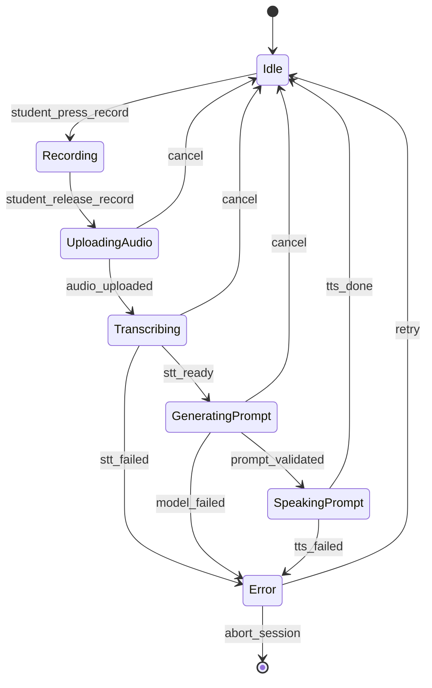

# Dialogos v0.1 — Implementation-Ready Spec

**Status:** Draft v0.1 (implementation scope locked to MVP)
**Primary platform:** Mobile (Flutter)
**Backend:** TypeScript (Fastify) + Prisma + Postgres (Supabase) + Object Storage (Supabase Storage or S3)
**Core interaction style:** Socrates Mode always-on (no alternate modes in MVP)

---

## 0) Product definition

**Dialogos is a voice-first training app for oral mastery of what a student studies.**
A student speaks. The system responds with short Socratic prompts that force definitions, distinctions, argument structure, and rhetorical clarity **without supplying the missing substance**.

### 0.1 Non-negotiables (MVP)

- **Socrates Mode is the default** and only mode.
- **One move per turn:** exactly one question or instruction per assistant turn.
- **No praise / no padding / no recap unless asked.**
- **Audio-first UX:** minimal screen attention; screen exists for control + review.
- **Student terminology:** call them *student*, not *user*.

### 0.2 Success criteria

- A student can complete a session hands-free/eyes-free except for starting/stopping.
- Output is consistently non-sycophantic and low-fluff.
- Artifacts (transcript, summary, rubric) feel like a coach's notes, not an essay generator.
- Cost per session is predictable and capped.

---

## 1) MVP scope

### 1.1 In scope

- Authentication: Apple + Google (LinkedIn optional later)
- CRUD for Topics, Sessions
- File uploads attached to Topics (optional in-session upload later)
- Voice session loop: record → transcribe → generate next prompt → speak prompt
- Transcript in screenplay format
- End-of-session summary with Grammar/Logic/Rhetoric sections
- Rubric scoring
- Paywall after free trial allowance
- Delete/export all personal data

### 1.2 Out of scope (v0.1)

- OCR extraction / quoting from PDFs
- Spaced repetition
- Multi-agent analysis
- "Friendly tutor" mode
- Social/community features
- Advanced analytics dashboards

---

## 2) Core domain objects

### 2.1 Student

Represents an authenticated person.

- `id` (UUID)
- `email` (nullable if provider doesn't provide; store normalized)
- `displayName`
- `createdAt`, `updatedAt`
- `settings` (JSON: voice rate, autoplay, strictness flags)
- `plan` (free | paid)
- `trialRemainingSeconds` (int)
- `deletedAt` (nullable)

### 2.2 Topic

Long-lived study project.

- `id` (UUID)
- `studentId` (FK)
- `title`
- `description` (optional)
- `createdAt`, `updatedAt`, `deletedAt`

### 2.3 TopicFile

Uploaded file reference (PDF/image/text).

- `id` (UUID)
- `topicId` (FK)
- `kind` (pdf | image | text | other)
- `storageKey`
- `originalName`
- `mimeType`
- `sizeBytes`
- `createdAt`, `deletedAt`

### 2.4 Session

Discrete practice run inside a topic.

- `id` (UUID)
- `topicId` (FK)
- `studentId` (FK redundant but convenient for queries)
- `status` (draft | active | ended | aborted)
- `startedAt`, `endedAt`
- `costCentsEstimate` (int)
- `trialSecondsUsed` (int)
- `deletedAt`

### 2.5 Turn

A single exchange: student utterance → system prompt.

- `id` (UUID)
- `sessionId` (FK)
- `index` (int, 0..n)
- `studentAudioKey` (nullable)
- `studentText` (nullable until STT completes)
- `assistantText` (the spoken prompt; short)
- `assistantPromptType` (enum)
- `assistantDetectedIssue` (enum/string)
- `createdAt`, `latencyMs`

### 2.6 Artifacts

Generated at end of session (and optionally mid-session).

- `SessionArtifact`
  - `id` (UUID)
  - `sessionId` (FK)
  - `kind` (transcript | summary | rubric | export_md)
  - `content` (TEXT or JSON)
  - `createdAt`

---

## 3) UX / flows (mobile)

### 3.1 Onboarding

1. Sign in (Apple/Google)
2. Audio-led onboarding rules (pre-recorded audio to avoid model cost):
   - "You will be questioned. I won't supply the missing substance."
   - "One prompt at a time. Keep answers short."
3. Create first Topic (title + optional description)
4. Start first Session (trial)

### 3.2 Navigation

- **Topics list**
  - Create Topic
  - Delete Topic (soft-delete; cascades to sessions/files)
- **Topic detail**
  - Sessions list (latest first)
  - Files list
  - Start new session
- **Session detail (review)**
  - Summary
  - Rubric
  - Transcript (screenplay)
  - Export

### 3.3 Session screen (audio-first)

- Dark background, minimal UI
- Primary control: **push-to-talk** (PTT) or tap-to-record
- Secondary: end session, pause, repeat prompt, show transcript
- Optional: keep screen awake toggle
- No distracting waveform; allow subtle "listening" indicator

---

## 4) Socrates Mode: behavioral contract

### 4.1 Output schema (strict)

All model outputs used for prompting MUST validate against this JSON schema:

```json
{
  "next_prompt": "string (<= 12 words default)",
  "prompt_type": "define | distinguish | premise | inference | objection | compress | clarify | example | scope | contradiction",
  "detected_issue": "vague_term | missing_premise | equivocation | drift | contradiction | unclear_referent | unsupported_claim | none",
  "stop_reason": "needs_definition | needs_example | needs_premise | needs_scope | ok_continue"
}
```

Only `next_prompt` is spoken to the student.

### 4.2 Style constraints

Hard rules (enforced by server-side validation + regeneration):

- `next_prompt` must be **one sentence**.
- No praise words (blocklist): "great", "perfect", "awesome", "nice job", "excellent", "love", "good" (in evaluative sense), etc.
- No recap unless the student explicitly requests a recap (detect via intent or explicit phrase).
- No unsolicited teaching paragraphs.
- Default `next_prompt` word count ≤ 12 (configurable to 16 max; keep it tight).
- No rhetorical flourishes; neutral, direct.

### 4.3 Prompting strategy

- Run model in **structured output mode**.
- Keep conversation context minimal:
  - include last N turns (N=6 by default)
  - include session goal (topic title + optional description)
  - include current drill target ("grammar/logic/rhetoric") **only if surfaced in artifact**, otherwise keep implicit.
- Use a "Socrates system message" that describes allowed moves + bans.
- Low temperature, small token cap.

---

## 5) Session state machine

### 5.1 State definitions

- `DRAFT`: created but not started
- `ACTIVE`: in progress
- `ENDED`: completed successfully
- `ABORTED`: ended early (network / user / payment)

### 5.2 Turn-level state machine

Each "turn" is an internal mini-state machine; the session is a repetition of turns.



### 5.3 Session lifecycle

- Create session → `DRAFT`
- Start session → `ACTIVE`
- End session (student ends or trial ends) → `ENDED` or `ABORTED`
- Generate artifacts as async job upon `ENDED`

---

## 6) Backend architecture (TypeScript)

### 6.1 Layers

1) **API Layer**
- Fastify routes
- auth, input/output validation
- calls Services only

2) **Service Layer**
- business logic orchestration
- session state transitions
- cost accounting
- queue job scheduling

3) **DataSource Layer**
- one class per table
- Prisma-only operations
- no business logic

### 6.2 Folder structure (suggested)

```
/src
  /api
    /v1
      topics.routes.ts
      sessions.routes.ts
      files.routes.ts
      billing.routes.ts
      account.routes.ts
    auth.plugin.ts
    validation.ts
  /services
    TopicService.ts
    SessionService.ts
    ArtifactService.ts
    BillingService.ts
    FileService.ts
  /dataSources
    StudentDataSource.ts
    TopicDataSource.ts
    TopicFileDataSource.ts
    SessionDataSource.ts
    TurnDataSource.ts
    SessionArtifactDataSource.ts
  /types
    api.ts
    dto.ts
    db.ts
    domain.ts
  /jobs
    queue.ts
    jobs.ts
    handlers/
      transcribeTurn.ts
      generatePrompt.ts
      renderArtifacts.ts
  /lib
    logger.ts
    errors.ts
    time.ts
```

### 6.3 Validation

- Use Zod (or equivalent) for request/response validation.
- For AI prompt outputs, validate strictly and regenerate if invalid.

---

## 7) Database schema (Postgres)

### 7.1 Tables

Minimal schema (DDL sketch):

```sql
create table students (
  id uuid primary key,
  email text,
  display_name text not null,
  plan text not null default 'free',
  trial_remaining_seconds int not null default 180,
  settings jsonb not null default '{}'::jsonb,
  created_at timestamptz not null default now(),
  updated_at timestamptz not null default now(),
  deleted_at timestamptz
);

create table topics (
  id uuid primary key,
  student_id uuid not null references students(id),
  title text not null,
  description text,
  created_at timestamptz not null default now(),
  updated_at timestamptz not null default now(),
  deleted_at timestamptz
);

create table topic_files (
  id uuid primary key,
  topic_id uuid not null references topics(id),
  kind text not null,
  storage_key text not null,
  original_name text not null,
  mime_type text,
  size_bytes bigint not null,
  created_at timestamptz not null default now(),
  deleted_at timestamptz
);

create table sessions (
  id uuid primary key,
  student_id uuid not null references students(id),
  topic_id uuid not null references topics(id),
  status text not null,
  started_at timestamptz,
  ended_at timestamptz,
  cost_cents_estimate int not null default 0,
  trial_seconds_used int not null default 0,
  created_at timestamptz not null default now(),
  deleted_at timestamptz
);

create table turns (
  id uuid primary key,
  session_id uuid not null references sessions(id),
  index int not null,
  student_audio_key text,
  student_text text,
  assistant_text text,
  assistant_prompt_type text,
  assistant_detected_issue text,
  latency_ms int,
  created_at timestamptz not null default now()
);

create unique index turns_session_index on turns(session_id, index);

create table session_artifacts (
  id uuid primary key,
  session_id uuid not null references sessions(id),
  kind text not null,
  content text not null,
  created_at timestamptz not null default now()
);
```

### 7.2 Notes

- Use soft delete (`deleted_at`) for compliance + safety.
- Add RLS (row-level security) if using Supabase auth directly; if backend owns auth, enforce via API.
- Ensure `turns(session_id, index)` unique for deterministic transcript ordering.

---

## 8) API design (REST, versioned)

### 8.1 Auth

Preferred: server verifies identity tokens from Apple/Google, then issues your own JWT session token.

- `Authorization: Bearer <jwt>`
- JWT contains `studentId`

### 8.2 Endpoints

All endpoints under `/v1`.

#### Topics

- `GET /v1/topics`
  - returns: list of topics (non-deleted)
- `POST /v1/topics`
  - body: `{ title, description? }`
- `GET /v1/topics/:topicId`
- `PATCH /v1/topics/:topicId`
  - body: `{ title?, description? }`
- `DELETE /v1/topics/:topicId`
  - soft-delete; cascades sessions/files

#### Topic files

- `GET /v1/topics/:topicId/files`
- `POST /v1/topics/:topicId/files/presign`
  - body: `{ kind, originalName, mimeType, sizeBytes }`
  - returns: `{ uploadUrl, storageKey }`
- `POST /v1/topics/:topicId/files`
  - body: `{ storageKey, kind, originalName, mimeType, sizeBytes }` (finalize metadata)
- `DELETE /v1/topics/:topicId/files/:fileId`

#### Sessions

- `GET /v1/topics/:topicId/sessions`
- `POST /v1/topics/:topicId/sessions`
  - body: `{ }`
  - creates `DRAFT`
- `POST /v1/sessions/:sessionId/start`
  - transitions to `ACTIVE`
- `POST /v1/sessions/:sessionId/end`
  - transitions to `ENDED`, enqueues artifact job
- `DELETE /v1/sessions/:sessionId`
  - soft delete

#### Turns (core loop)

- `POST /v1/sessions/:sessionId/turns/presign-audio`
  - returns uploadUrl + storageKey
- `POST /v1/sessions/:sessionId/turns`
  - body: `{ studentAudioKey, durationMs }`
  - server enqueues STT + prompt job
  - returns: `{ turnId }`
- `GET /v1/sessions/:sessionId/turns/:turnId`
  - returns turn including `assistantText` when ready
- Optional realtime:
  - `GET /v1/sessions/:sessionId/stream` (SSE or WebSocket) to push `assistantText` updates

#### Artifacts

- `GET /v1/sessions/:sessionId/artifacts`
- `GET /v1/sessions/:sessionId/artifacts/:artifactId`

#### Billing / trial

- `GET /v1/billing/status`
- `POST /v1/billing/checkout` (store-specific; may be handled client-side)
- `POST /v1/billing/webhook` (server-to-server)

#### Account privacy

- `POST /v1/account/export`
- `POST /v1/account/delete`
  - schedules deletion job; immediate soft-delete; hard-delete within policy window

---

## 9) Job queue + async processing

### 9.1 Why a queue

- STT + model call + TTS can be slow and should not block request threads.
- Artifact generation should run after session end.

### 9.2 Jobs

- `TRANSCRIBE_TURN(turnId)`
  - fetch audio from storage
  - run STT
  - write `studentText`
- `GENERATE_PROMPT(turnId)`
  - collect last N turns
  - call model for strict JSON prompt
  - validate; regenerate if invalid
  - write `assistantText`, prompt metadata
- `RENDER_ARTIFACTS(sessionId)`
  - build transcript (screenplay)
  - build summary (G/L/R sections)
  - build rubric
  - persist artifacts

### 9.3 Speaking (TTS)

MVP approach: generate TTS on-demand in client from `assistantText` OR server generates audio.

- Prefer client-side TTS initially for simplicity/cost (device voices).
- If you need consistent voice across platforms, generate on server and store `assistantAudioKey` per turn.

---

## 10) Cost controls

- Track per-session:
  - total STT seconds
  - total model tokens
  - total TTS seconds (if server TTS)
- Hard caps:
  - `trialRemainingSeconds` decrement by recorded speech duration
  - stop session when exhausted, then prompt paywall
- Model call caps:
  - small `max_output_tokens`
  - minimal context window
  - forbid "assistant essays" by schema validation

---

## 11) Transcript format (screenplay)

### 11.1 Example

```
STUDENT: A cause is...
DIALOGOS: Define "cause" in one sentence.
STUDENT: By cause I mean...
DIALOGOS: Distinguish material from formal cause.
...
```

### 11.2 Rendering rules

- Always left-aligned.
- `STUDENT:` and `DIALOGOS:` labels.
- Optional subtle color tint per speaker in UI (not bubbles).

---

## 12) Session summary format

### 12.1 Summary object

- `one_paragraph_summary`
- `grammar_notes[]`
- `logic_notes[]`
- `rhetoric_notes[]`
- `open_questions[]`
- `rubric_scores`

### 12.2 Rubric

Scores 1–5 with one-line evidence:

- Clarity
- Definitions
- Structure
- Objection-handling
- Drift

Rules:

- Evidence must quote student text snippets, not invent content.

---

## 13) Privacy & deletion

### 13.1 Delete topic/session

Soft-delete and hide from UI.
Queue hard-delete (audio/files/artifacts) within a retention window (define later).

### 13.2 Delete account

- Soft-delete student record
- cascade soft-delete all related records
- enqueue hard-delete job:
  - delete storage objects
  - delete DB rows (or anonymize) per policy

### 13.3 Export

Bundle:

- topics.json
- sessions.json
- transcripts.md
- summaries.json
- rubric.json

---

## 14) Mobile (Flutter) client architecture

### 14.1 Layers

1) API clients (pure HTTP):
- `TopicApiClient`
- `SessionApiClient`
- `FileApiClient`
- `BillingApiClient`

2) Services (orchestrate + caching):
- `TopicService`
- `SessionService`
- `AudioService`
- `ArtifactService`

3) UI (screens)
- TopicsListScreen
- TopicDetailScreen
- SessionScreen
- SessionReviewScreen
- AccountSettingsScreen

### 14.2 Suggested state management

Pick one and stay consistent:

- Riverpod (recommended for modularity) OR Bloc.

### 14.3 Session loop (client)

- Record audio
- Upload audio via presigned URL
- POST turn finalize to backend
- Subscribe for prompt readiness (poll or websocket)
- Speak prompt
- Repeat

---

## 15) Implementation plan (phased)

### Phase 0: foundations

- Repo setup (backend + mobile)
- Auth flow
- Database schema + Prisma
- Topic CRUD

### Phase 1: session loop

- Session start/end
- Turn creation + audio upload
- STT job + prompt generation job
- Basic UI session screen

### Phase 2: artifacts + review

- Transcript renderer
- Summary + rubric generation
- Session review screens
- Export + delete account

### Phase 3: billing

- Trial cap
- Paywall + subscription
- Webhook validation
- Post-pay unlock

---

## 16) Testing requirements

- Unit tests for Services (state transitions, caps)
- Contract tests for API (OpenAPI snapshot)
- Integration test: full "turn" pipeline with mocked STT/model
- Load test: concurrent sessions (queue behavior)
- Security tests: auth bypass, topic/session access control

---

## 17) Open questions (explicitly tracked)

- Do we do device TTS or server TTS for v0.1?
- Do we support streaming (websocket) or polling for prompt readiness?
- Trial allowance: one session vs N minutes?
- Storage provider choice: Supabase Storage vs S3 (cost/ops tradeoff)

---

## Appendix A — Example system prompt (server-side)

(Provide as a template; implement in code, not in UI)

- You are Dialogos. You speak in short, neutral prompts.
- You may only ask one question or give one instruction per turn.
- You must not praise the student.
- You must not recap what the student said unless asked.
- You must not supply missing arguments or content.
- Output MUST match the JSON schema exactly.
